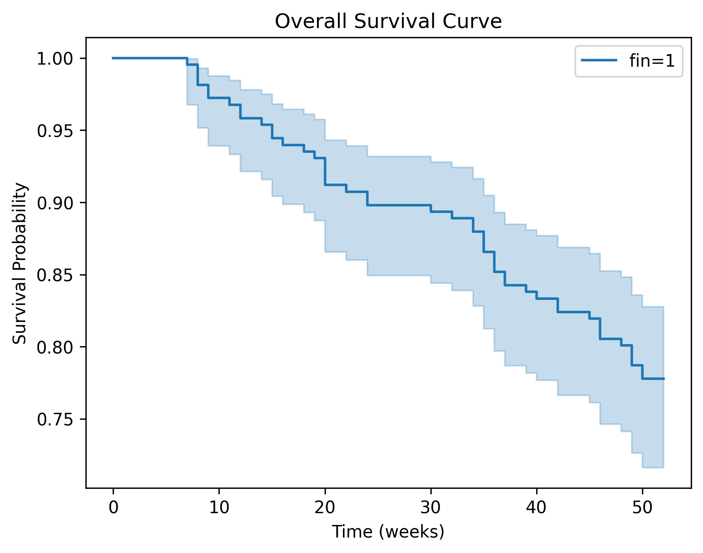
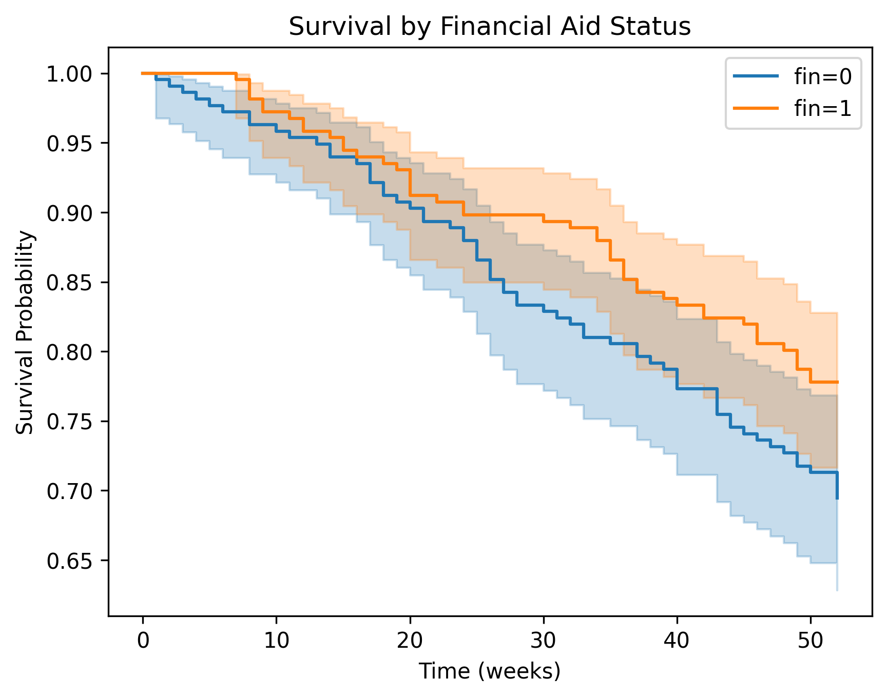

# Survival Analysis of Time-to-Arrest Outcomes (Rossi Dataset)
## Overview

This project presents a time-to-event survival analysis using the Rossi recidivism dataset. The objective was to evaluate predictors of arrest over time using Kaplan–Meier estimation and Cox proportional hazards modelling.

The analysis focuses on understanding how structural and individual-level factors influence hazard of re-arrest.

# Dataset

The Rossi dataset (n = 432) contains longitudinal follow-up data on individuals released from incarceration.

#Key variables:

- week — time to arrest (weeks)

- arrest — event indicator (1 = arrest, 0 = censored)

- fin — financial aid status

- age — age at release

- prio — number of prior convictions

- Additional socio-demographic covariates

# Methods

The analysis includes:

1. Kaplan–Meier survival estimation (overall and stratified by financial aid)

2. Log-rank test for unadjusted group comparison

3. Multivariable Cox proportional hazards regression

4. Proportional hazards assumption testing

5. Model performance evaluation using concordance index

6. All analyses were conducted using Python (lifelines, scikit-learn, matplotlib).

# Key Results

- Financial aid was associated with a 32% lower hazard of arrest
(HR = 0.68, 95% CI 0.47–1.00, p = 0.05).

- Age was significantly associated with reduced hazard
(HR = 0.94 per year increase, p = 0.01).

- Prior convictions were strongly associated with increased hazard
(HR = 1.10 per additional conviction, p < 0.005).

- Model concordance index: 0.64 (moderate discrimination).

The proportional hazards assumption was violated for age and work experience, suggesting that their effects may vary over time. Other covariates met the assumption.

Figures
Overall Survival Curve
## Kaplan–Meier Survival Curve

Survival by Financial Aid Status
## Survival by Financial Aid Status

# Interpretation

Results suggest that both socioeconomic intervention (financial aid) and prior criminal history influence time-to-arrest outcomes. Prior convictions emerged as the strongest predictor. Financial aid showed a potentially protective effect, though statistical significance was borderline.

This project demonstrates application of survival modelling, assumption diagnostics, and hazard ratio interpretation in an observational dataset.

# Limitations

- Observational data, no causal inference

- Moderate sample size

- Historical dataset

- Model discrimination modest

# Tools

- Python

- lifelines

- pandas

- matplotlib

- scikit-learn
